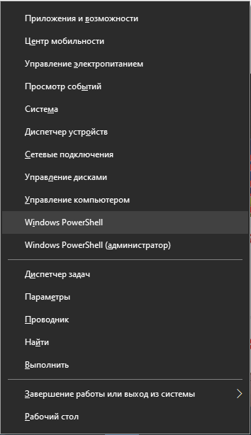
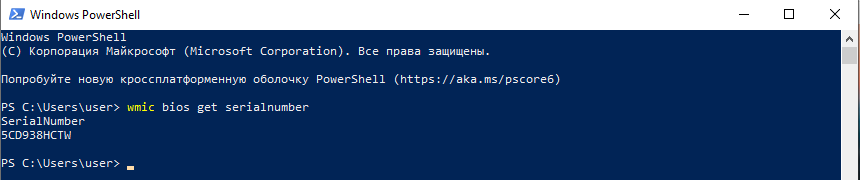
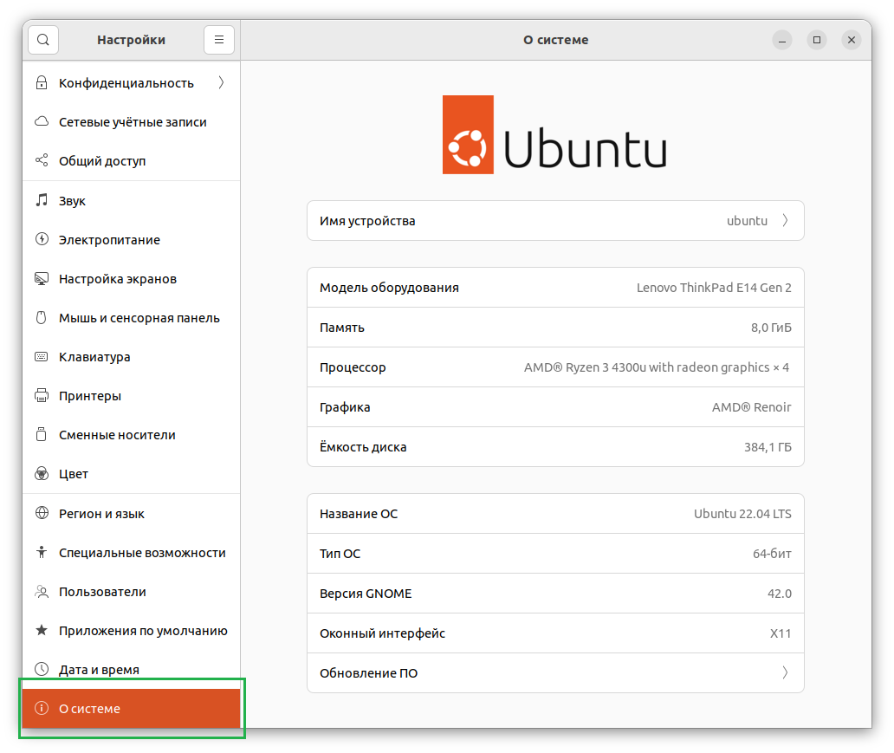
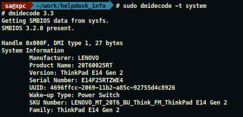
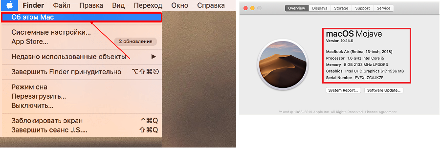
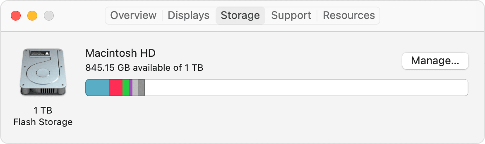

### Windows
    - Жмем комбинацио Win + R
    - Вводим команду msinfo32 и жмем Enter

    - Делаем скрины пунктов меню "Сведения о системе", "Дисплей", "Диски"

    
    - Далее Win+X пункт PowerShell

    - Вводим команду wmic bios get serialnumber
  

  

________________________________________________________________________________________

  

### Ubuntu
    - Заходим в меню и выбираем пункт "Настройки"
    - Переходим в самый низ, пункт "О системе"

    - В терминале вводим команду: sudo dmidecode -t system и делаем скрин

  

________________________________________________________________________________________

  

### MAC OS
    - В верхнем, левом углу идем в меню Apple далее выбираем пункт "Об этом МАС"

