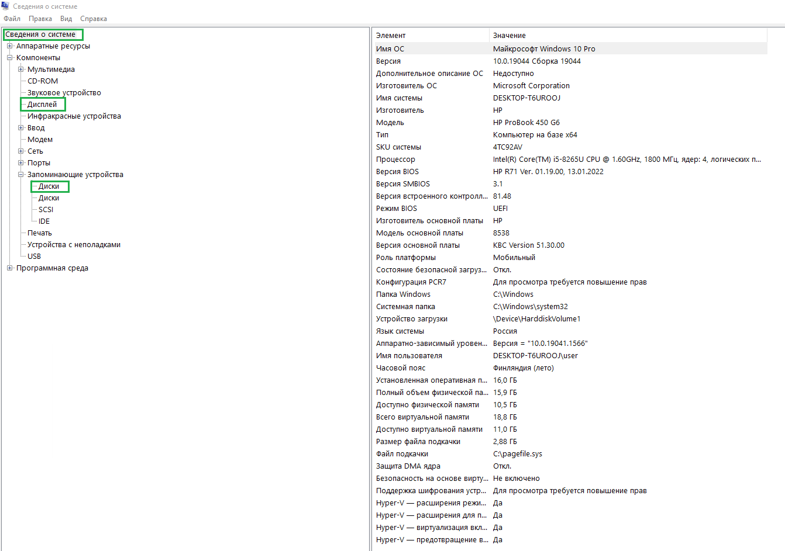

  
  

######################################################

GET OS INFO

######################################################

  
  
  

________________________________________________________________________________________

  
  

##### Windows
 - Жмем комбинацио Win + R
 - Вводим команду msinfo32 и жмем Enter
> 

 - Делаем скрины пунктов меню "Сведения о системе", "Дисплей", "Диски"
> 

##### Ubuntu
> - Заходим в меню и выбираем пункт "Настройки"
> - Переходим в самый низ, пункт "О системе"

##### MAC OS
> - В верхнем, левом углу идем в меню Apple () далее выбираем пункт "Об этом МАС"

